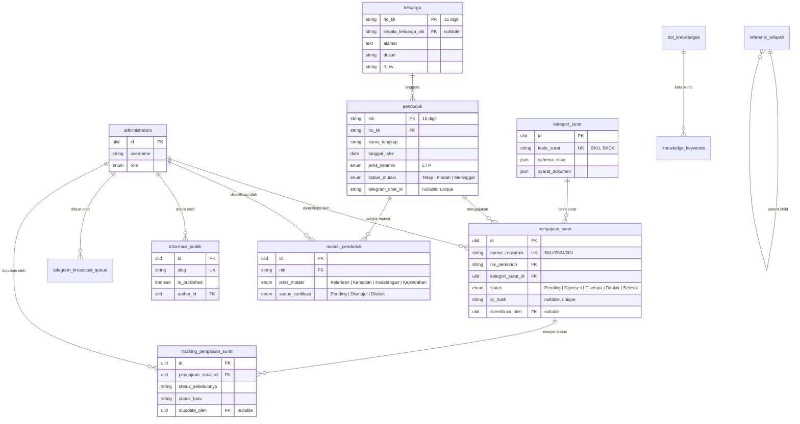

# AvaraDesa — Sistem Informasi Desa Terpadu

Sistem Informasi Desa Terpadu berbasis Laravel + Filament + Vue 3. Multi-platform (web, mobile, desktop).

**Akses Cepat:**
- Website: [https://avaradesa.my.id](https://avaradesa.my.id)
- Admin Panel: [https://avaradesa.my.id/admin/login](https://avaradesa.my.id/admin/login)
- Dokumentasi API: [https://avaradesa.my.id/docs](https://avaradesa.my.id/docs)

### Demo Account

| Role | Username | Password |
|:-----|:---------|:---------|
| Kepala Desa | `kepala desa` | `kepaladesa789` |
| Sekretaris Desa | `sekdes` | `sekdes456` |
| Operator | `operator` | `operator123` |

**Akun Warga Demo:**
- NIK: `1118060512900001` — No. KK: `1118060001000001`
- Nama: Muhammad Rizal — Password: `password`
- Login di [https://avaradesa.my.id/login](https://avaradesa.my.id/login)

> **Peringatan:** Ubah password segera setelah login pertama. Password ini hanya untuk pengembangan/testing.

---

- [1. Pendahuluan](#1-pendahuluan)
- [2. Spesifikasi Teknis](#2-spesifikasi-teknis)
- [3. Arsitektur Sistem](#3-arsitektur-sistem)
- [4. Instalasi dan Setup](#4-instalasi-dan-setup)
- [5. Struktur Proyek](#5-struktur-proyek)
- [6. Skema Database](#6-skema-database)
- [7. Spesifikasi API](#7-spesifikasi-api)
- [8. Integrasi AI dan Telegram](#8-integrasi-ai-dan-telegram)
- [9. Keamanan Sistem](#9-keamanan-sistem)
- [10. Aplikasi Mobile & Desktop (Capacitor + Electron)](#10-aplikasi-mobile--desktop-capacitor--electron)
- [11. Activity Log System](#11-activity-log-system)
- [12. Docker dan DevOps](#12-docker-dan-devops)
- [13. Pengujian](#13-pengujian)
- [14. Peta Jalan](#14-peta-jalan)
- [15. Kontribusi](#15-kontribusi)
- [16. Lisensi](#16-lisensi)
- [Changelog](#changelog)

---

## 1. Pendahuluan

### 1.1 Tentang AvaraDesa

AvaraDesa adalah platform administrasi desa berbasis web, mobile (Android/iOS), dan desktop (Windows/Mac/Linux). Warga bisa mengurus surat, cek data kependudukan, dan lacak status pengajuan secara mandiri — tanpa harus bolak-balik ke kantor desa. Admin (kepala desa, sekdes, operator) kelola semuanya dari panel Filament.

### 1.2 Visi dan Misi

**Visi**: Administrasi desa yang transparan, akuntabel, dan efisien.

**Misi**:
- Digitalisasi administrasi kependudukan dan pencatatan sipil
- Pengajuan surat mandiri tanpa birokrasi fisik
- Asisten AI 24 jam untuk layanan informasi warga
- Keamanan data warga (audit trail, enkripsi, security headers)
- Aplikasi multiplatform biar aksesibel di perangkat mana pun

### 1.3 Target Pengguna

| Peran | Deskripsi |
|:------|:----------|
| **Warga Desa** | Masyarakat yang membutuhkan layanan administrasi desa secara daring via PWA atau aplikasi mobile/desktop |
| **Kepala Desa** | Pejabat tertinggi desa yang memverifikasi dan menandatangani dokumen surat |
| **Sekretaris Desa** | Mengelola data kependudukan, informasi publik, dan konfigurasi sistem |
| **Operator** | Staf yang memproses pengajuan surat dan mutasi kependudukan |
| **Bot Telegram** | Asisten virtual berbasis AI yang melayani pertanyaan warga secara otomatis 24/7 |

---

## 2. Spesifikasi Teknis

### 2.1 Stack Backend (Server)

| Komponen | Versi | Keterangan |
|:---------|:------|:-----------|
| PHP | ^8.3 | Runtime dengan optimasi strictly typed |
| Laravel Framework | ^13.8 | Mesin API, manajemen antrean, dan sesi |
| Filament PHP | 5.6.5 | Panel administrasi untuk Kepala Desa, Sekdes, dan Operator |
| Laravel Sanctum | ^4.3 | Otentikasi token berbasis SHA-256 (expiry 1440 menit / 24 jam) |
| Laravel AI | ^0.9.1 | SDK AI multi-provider resmi Laravel (16 driver) |
| MySQL / MariaDB | 8.0+ / 10.6+ | Database produksi (SQLite untuk testing) |
| Redis | 6+ | Caching, queue manager, dan session driver |
| Barryvdh DomPDF | ^3.0 | Generator dokumen administrasi format PDF |
| Simple QR Code | ^4.2 | Tanda tangan elektronik (TTE) berbasis hash SHA-256 |
| AWS SDK PHP | ^3.388 | Integrasi AWS Bedrock untuk AI provider |
| WhatsApp Multi-Provider | — | wa-gateway (Baileys) + Fonnte (cloud) |
| **spatie/laravel-activitylog** | **^4.12.3** | Activity logging engine (menggantikan audit_logs legacy) |

### 2.2 Stack Frontend (Klien Web)

| Komponen | Versi | Keterangan |
|:---------|:------|:-----------|
| Vue 3 | ^3.5.38 | Framework UI dengan Composition API |
| Inertia.js | ^3.4.0 | Konektor SPA tanpa overhead API REST eksternal |
| Tailwind CSS | ^4.3.0 | Utility-first CSS framework |
| Vite | ^8.0.16 | Build tool dengan plugin Laravel |
| DOMPurify | ^3.4.11 | Sanitasi XSS pada konten HTML dinamis |
| SweetAlert2 | ^11.26.25 | Modal dan notifikasi interaktif |
| ESLint | ^10.6.0 | Linter kode JavaScript/Vue |
| Vitest | ^4.1.8 | Framework pengujian frontend |
| Axios | ^1.17.0 | HTTP client |

### 2.3 Stack Mobile & Desktop (Capacitor + Electron)

| Komponen | Versi | Keterangan |
|:---------|:------|:-----------|
| Vue 3 | ^3.5.39 | Framework UI dengan Composition API + TypeScript |
| Pinia | ^4.0.2 | State management reaktif |
| Vue Router | ^5.2.0 | Routing deklaratif |
| Tailwind CSS | ^4.3.3 | Utility-first CSS framework |
| Capacitor | ^8.4.2 | Native runtime untuk Android & iOS |
| Electron | ^43.1.1 | Desktop runtime untuk Windows, Mac & Linux |
| TypeScript | ~6.0.2 | Type safety |
| Vite | ^8.1.1 | Build tool |

### 2.4 Stack Pengujian

| Komponen | Versi | Keterangan |
|:---------|:------|:-----------|
| PHPUnit | ^12.5.12 | ~200 test methods backend (unit + feature) |
| Vitest | ^4.1.8 | 14 test methods frontend Vue (7 spec files) |
| @vue/test-utils | ^2.4.11 | Utilitas pengujian komponen Vue |
| @vitest/coverage-v8 | ^4.1.8 | Laporan cakupan pengujian |

---

## 3. Arsitektur Sistem

### 3.1 Diagram Arsitektur

Sistem dibangun menggunakan arsitektur monolit modern 4 layer yang menggabungkan backend, frontend web, aplikasi multiplatform, dan integrasi layanan eksternal dalam satu repositori terpadu.

```
┌─────────────────────────────────────────────────────────────────┐
│                    Frontend Client Layer                         │
├─────────────────────────────────────────────────────────────────┤
│  Portal Publik & PWA Warga (Inertia.js + Vue 3 + Tailwind v4)  │
│  Aplikasi Mobile/Desktop (Vue 3 + Pinia + Capacitor/Electron)   │
│  Build Engine: Vite 8 (Web) / Vite 8 + Capacitor 8 (Mobile)    │
│                          / Electron 43 (Desktop)                 │
│  Sanitasi: DOMPurify (Web)                                      │
└──────────────────────────┬──────────────────────────────────────┘
                           │ (Protokol Inertia / REST API)
                           ▼
┌─────────────────────────────────────────────────────────────────┐
│           Backend & Admin Platform (Laravel 13)                  │
├─────────────────────────────────────────────────────────────────┤
│  Dashboard Admin & Operator (Filament PHP v5)                    │
│  RESTful API Engine (Sanctum Auth, 57 Endpoint, 20 Web Routes)  │
│  Document Processor (DomPDF + QR Code SHA-256)                   │
│  Security Layer (CSP, HSTS, Rate Limiting, Audit Trail)          │
│  5 Authorization Policies (RBAC per Model)                       │
│  Activity Log System (spatie/laravel-activitylog, 12 locations)  │
└──────────────────────────┬──────────────────────────────────────┘
                           │
                           ▼
┌─────────────────────────────────────────────────────────────────┐
│                  Data & External Service Layer                    │
├─────────────────────────────────────────────────────────────────┤
│  Database: MySQL 8.0+ / MariaDB (38 tabel)                      │
│  Cache & Queue: Redis 6+ (session, cache, queue worker)         │
│  Cloud Storage: S3 / Cloudflare R2 (auto-switch)                │
│  AI Multi-Provider (16 Laravel AI SDK + 6 Custom Class):         │
│    ├── Gemini (gemini-pro) — aktif di fallback chain             │
│    ├── OpenAI (GPT-4o-mini) — aktif di fallback chain            │
│    ├── DeepSeek — class siap, tinggal aktifkan                   │
│    ├── Ollama — class siap (Llama, Mistral, dll)                 │
│    ├── AWS Bedrock — class siap (Claude/Titan)                   │
│    └── 11 provider lain via Laravel AI SDK                       │
│  Notifikasi & Bot: Telegram Bot API + WhatsApp API               │
└─────────────────────────────────────────────────────────────────┘
```

### 3.2 Penjelasan Layer

- **Frontend**: Tiga kanal — web (Vue 3 + Inertia), mobile (Capacitor), desktop (Electron). Sanitasi XSS via DOMPurify.
- **Backend**: Laravel 13 + Filament 5 untuk panel admin. REST API via Sanctum, 5 policy RBAC, security headers (CSP, HSTS), rate limiting, activity log.
- **Data & Eksternal**: MySQL/Redis. 16 AI provider via Laravel AI SDK + 6 custom class dengan fallback chain. Notifikasi Telegram + WhatsApp.

---

## 4. Instalasi dan Setup

### 4.1 Persyaratan Sistem

| Komponen | Versi Minimum |
|:---------|:-------------|
| PHP | 8.3+ (Extensions: pdo_mysql, mbstring, exif, pcntl, bcmath, gd, zip, redis) |
| Node.js | 20+ |
| MySQL / MariaDB | 8.0+ / 10.6+ |
| Redis Server | 6+ (direkomendasikan) |
| Composer | 2.x |
| Node.js | 20+ (untuk build frontend & apps) |

### 4.2 Instalasi Lokal (Development)

**1. Clone Repositori**

```bash
git clone <repository-url> avaradesa
cd avaradesa
```

**2. Instal Dependensi Backend**

```bash
composer install
```

**3. Instal Dependensi Frontend Web**

```bash
npm install
```

**4. Instal Dependensi Aplikasi Mobile/Desktop**

```bash
cd apps
npm install
cd ..
```

**5. Konfigurasi Environment**

```bash
cp .env.example .env
php artisan key:generate
```

Sesuaikan konfigurasi pada `.env`:

```env
DB_CONNECTION=mysql
DB_DATABASE=avaradesa
DB_USERNAME=root
DB_PASSWORD=

TELEGRAM_BOT_TOKEN=your_bot_token

# AI Provider (pilih salah satu atau semua)
AI_DEFAULT_PROVIDER=gemini
GEMINI_API_KEY=your_key
OPENAI_API_KEY=your_key
DEEPSEEK_API_KEY=your_key
OLLAMA_URL=http://localhost:11434
```

**6. Migrasi Database & Seeding**

```bash
php artisan migrate --seed
php artisan storage:link
```

**7. Jalankan Aplikasi**

```bash
php artisan serve
npm run dev
php artisan queue:work  # opsional
```

Aplikasi dapat diakses di `http://localhost:8000`.

### 4.3 Migrasi Activity Log (jika upgrade dari versi lama)

Jika sudah memiliki data di tabel `audit_logs` (legacy), jalankan:

```bash
php artisan log:migrate-from-audit
```

Perintah ini memindahkan seluruh data `audit_logs` ke `activity_log` milik spatie/laravel-activitylog, lalu menonaktifkan resource AuditLogResource lama.

---

## 5. Struktur Proyek

```
avaradesa/
├── app/
│   ├── Console/Commands/          # Artisan commands (system:cleanup, log:migrate-from-audit)
│   ├── Filament/                  # Panel administrasi Filament PHP
│   │   ├── AdminPanelProvider.php
│   │   ├── Auth/AdminLogin.php
│   │   ├── Pages/                 # Dashboard, PengaturanSistem, PengaturanKontenPublik
│   │   ├── Resources/             # CRUD resources (Penduduk, Surat, Aspirasi, ActivityLog, dll)
│   │   └── Widgets/               # AdminStatsOverview, ServerPerformance, TrafficChart, dll
│   ├── Http/
│   │   ├── Controllers/Api/       # Controller API RESTful (13 controller)
│   │   ├── Controllers/Web/       # Controller web Inertia (6 controller)
│   │   ├── Middleware/            # Security headers, cache, traffic, Inertia
│   │   ├── Requests/             # Form Request validasi (Api/ + Web/ + AppApi/)
│   │   └── Resources/            # API Resource transformer (8 + 2 AppApi)
│   ├── Jobs/                      # Job antrean (6 job: PDF, Telegram, Broadcast, WhatsApp)
│   ├── Models/                    # 26 model Eloquent
│   ├── Policies/                  # 5 authorization policies (RBAC)
│   ├── Providers/                 # Service provider
│   └── Services/
│       ├── AiProviders/           # 6 class: BaseAiProvider + 5 provider (Gemini, OpenAI, DeepSeek, Ollama, Bedrock)
│       ├── FallbackAiService.php  # Fallback chain multi-provider
│       ├── SystemLogger.php       # Activity log wrapper (spatie/laravel-activitylog)
│       ├── TelegramService.php    # Telegram Bot API wrapper
│       ├── TelegramKnowledgeService.php # Knowledge base + RAG
│       ├── WhatsAppService.php    # WhatsApp API wrapper
│       ├── PdfGeneratorService.php# Generator PDF + QR Code
│       ├── StatistikService.php   # Agregasi statistik kependudukan
│       ├── ImageService.php       # Kompresi gambar ke WebP
│       └── GeminiAiService.php    # Gemini AI service (legacy)
├── apps/                          # Aplikasi Multiplatform (Vue 3 + Capacitor + Electron)
│   ├── src/                       # Source code Vue 3 + TypeScript + Pinia
│   ├── capacitor.config.ts        # Konfigurasi Capacitor
│   ├── electron/                  # Main process Electron
│   ├── electron-builder.yml       # Build config Electron
│   ├── android/                   # Native Android project
│   ├── ios/                       # Native iOS project
│   └── package.json               # Dependensi Vue 3, Pinia, Capacitor, Electron, TypeScript
├── config/                        # Konfigurasi Laravel (sanctum, ai, services, activitylog, dll)
├── database/
│   ├── factories/                 # 10 factory untuk testing
│   ├── migrations/                # 48 migration file
│   └── seeders/                   # 12 seeder (data awal + dummy)
├── resources/
│   ├── css/                       # Tailwind CSS dengan design tokens
│   ├── js/
│   │   ├── Components/            # 13 komponen Vue reusable
│   │   ├── Layouts/               # CitizenLayout, PublicLayout
│   │   ├── Pages/                 # Halaman Vue (Auth, Citizen, Public)
│   │   └── Utils/                 # alert, imageCompressor, sanitize
│   └── views/                     # Blade templates (app, PDF surat)
├── tests/
│   ├── Feature/                   # 17 file feature test
│   └── Unit/                      # 23 file unit test
├── .docker/                       # Konfigurasi Nginx + Supervisor
├── .github/workflows/             # CI/CD pipeline (Laravel + Vue)
├── Dockerfile                     # PHP-FPM 8.3 + Nginx + Supervisor
├── docker-compose.yml             # 3 services (app + db + redis)
└── DEPLOY.md                      # Panduan deployment produksi (1GB RAM)
```

---

## 6. Skema Database

38 tabel dengan relasi sebagai berikut:



**Tabel pendukung**: `pengaturan_desa`, `pengaturan_frontend`, `inventaris_fasilitas`, `traffic_logs`, `chatbot_logs`, `agent_conversations`, `activity_log`, `notifications`, `personal_access_tokens`, `knowledge_keywords`, `referensi_wilayah` (self-referencing hierarki provinsi→kabupaten→kecamatan→desa).

**Tabel referensi**: `ref_agama`, `ref_pendidikan`, `ref_pekerjaan`, `ref_status_perkawinan`, `ref_status_keluarga`, `kategori_informasi`, `ref_jenis_fasilitas`.

---

## 7. Spesifikasi API

Seluruh endpoint API berada di bawah prefix `/api/v1/`. **Total: 57 Endpoint API + 20 Rute Web**.

### 7.1 Autentikasi

| Metode | Endpoint | Deskripsi | Otorisasi |
|:-------|:---------|:----------|:----------|
| POST | `/v1/auth/login/warga` | Login warga (NIK + No KK) | Public (throttle:5,1) |
| POST | `/v1/auth/login/admin` | Login admin (username + password) | Public (throttle:5,1) |
| POST | `/v1/auth/register-pin` | Daftarkan PIN untuk login cepat | Public (throttle:5,1) |
| POST | `/v1/auth/login-pin` | Login menggunakan PIN | Public (throttle:5,1) |
| POST | `/v1/auth/login-biometric` | Login menggunakan biometrik | Public (throttle:5,1) |
| POST | `/v1/auth/reset-pin` | Reset PIN (dengan verifikasi) | Public (throttle:3,1) |
| POST | `/v1/auth/logout` | Logout dan hapus token | Bearer Token |
| GET | `/v1/auth/profile` | Profil pengguna yang login | Bearer Token |
| POST | `/v1/auth/bind-telegram` | Hubungkan akun dengan Telegram | Bearer (Warga) |
| POST | `/v1/auth/register-biometric` | Daftarkan perangkat biometrik | Bearer (Warga) |

### 7.2 Portal Publik

| Metode | Endpoint | Deskripsi | Otorisasi |
|:-------|:---------|:----------|:----------|
| GET | `/v1/informasi` | Daftar informasi publik (published) | Public |
| GET | `/v1/informasi/{slug}` | Detail informasi berdasarkan slug | Public |
| GET | `/v1/statistik/demografi` | Data agregat demografi kependudukan | Public |
| GET | `/v1/statistik/layanan` | Data agregat layanan surat & mutasi | Public |
| GET | `/v1/verifikasi/{hash}` | Validasi keaslian dokumen via QR hash | Public |

### 7.3 Dashboard & Layanan Warga

| Metode | Endpoint | Deskripsi | Otorisasi |
|:-------|:---------|:----------|:----------|
| GET | `/v1/dashboard` | Dashboard warga (ringkasan data) | Bearer (Warga) |
| GET | `/v1/surat/kategori` | Daftar kategori surat aktif | Bearer (Warga) |
| GET | `/v1/surat/kategori/{id}` | Detail persyaratan kategori surat | Bearer (Warga) |
| POST | `/v1/surat/pengajuan` | Ajukan pembuatan surat baru | Bearer (Warga) |
| GET | `/v1/surat/pengajuan` | Riwayat pengajuan surat warga | Bearer (Warga) |
| GET | `/v1/surat/pengajuan/{id}` | Detail & tracking pengajuan | Bearer (Warga) |
| GET | `/v1/surat/pengajuan/{id}/download` | Download PDF surat | Bearer (Warga) |
| POST | `/v1/mutasi` | Ajukan mutasi kependudukan | Bearer (Warga) |
| GET | `/v1/mutasi` | Riwayat mutasi warga | Bearer (Warga) |
| POST | `/v1/chat` | Chat dengan asisten AI | Bearer (throttle:10,1) |

### 7.4 Sinkronisasi Offline

| Metode | Endpoint | Deskripsi | Otorisasi |
|:-------|:---------|:----------|:----------|
| POST | `/v1/sync/push` | Sinkronisasi data dari perangkat ke server | Bearer (Warga) |
| GET | `/v1/sync/pull` | Tarik data terbaru dari server | Bearer (Warga) |

### 7.5 Administrasi — Manajemen Penduduk

| Metode | Endpoint | Deskripsi | Otorisasi |
|:-------|:---------|:----------|:----------|
| GET | `/v1/admin/penduduk` | Daftar seluruh penduduk | Bearer (Admin) |
| GET | `/v1/admin/penduduk/{id}` | Detail penduduk | Bearer (Admin) |
| POST | `/v1/admin/penduduk` | Tambah penduduk baru | Bearer (Admin) |
| PUT | `/v1/admin/penduduk/{id}` | Update data penduduk | Bearer (Admin) |
| DELETE | `/v1/admin/penduduk/{id}` | Hapus penduduk | Bearer (Admin) |

### 7.6 Administrasi — Surat, Mutasi & Informasi

| Metode | Endpoint | Deskripsi | Otorisasi |
|:-------|:---------|:----------|:----------|
| GET | `/v1/admin/surat/pengajuan` | Semua pengajuan surat | Bearer (Admin) |
| POST | `/v1/admin/surat/pengajuan/{id}/approve` | Setujui pengajuan | Bearer (Admin) |
| POST | `/v1/admin/surat/pengajuan/{id}/reject` | Tolak pengajuan | Bearer (Admin) |
| GET | `/v1/admin/mutasi` | Semua pengajuan mutasi | Bearer (Admin) |
| POST | `/v1/admin/mutasi/{id}/approve` | Setujui mutasi | Bearer (Admin) |
| POST | `/v1/admin/mutasi/{id}/reject` | Tolak mutasi | Bearer (Admin) |
| GET | `/v1/admin/informasi` | Semua informasi (termasuk draft) | Bearer (Admin) |
| GET | `/v1/admin/informasi/{id}` | Detail informasi | Bearer (Admin) |
| POST | `/v1/admin/informasi` | Buat informasi baru | Bearer (Admin) |
| PUT | `/v1/admin/informasi/{id}` | Update informasi | Bearer (Admin) |
| DELETE | `/v1/admin/informasi/{id}` | Hapus informasi | Bearer (Admin) |
| POST | `/v1/admin/statistik/clear-cache` | Bersihkan cache statistik | Bearer (Admin) |

### 7.7 Administrasi — Resource Management

| Metode | Endpoint | Deskripsi | Otorisasi |
|:-------|:---------|:----------|:----------|
| GET | `/v1/admin/keluarga` | Daftar keluarga | Bearer (Admin) |
| POST | `/v1/admin/keluarga` | Tambah keluarga | Bearer (Admin) |
| DELETE | `/v1/admin/keluarga/{no_kk}` | Hapus keluarga | Bearer (Admin) |
| GET | `/v1/admin/kategori-surat` | Daftar kategori surat | Bearer (Admin) |
| POST | `/v1/admin/kategori-surat` | Tambah kategori surat | Bearer (Admin) |
| PUT | `/v1/admin/kategori-surat/{id}` | Update kategori surat | Bearer (Admin) |
| DELETE | `/v1/admin/kategori-surat/{id}` | Hapus kategori surat | Bearer (Admin) |
| GET | `/v1/admin/fasilitas` | Daftar fasilitas desa | Bearer (Admin) |
| POST | `/v1/admin/fasilitas` | Tambah fasilitas | Bearer (Admin) |
| DELETE | `/v1/admin/fasilitas/{id}` | Hapus fasilitas | Bearer (Admin) |
| GET | `/v1/admin/audit-log` | Log aktivitas sistem | Bearer (Admin) |

### 7.8 Gateway Sync (WhatsApp)

| Metode | Endpoint | Deskripsi | Otorisasi |
|:-------|:---------|:----------|:----------|
| GET | `/v1/gateway/sync` | Sinkronisasi FAQ + kategori + template notifikasi ke wa-gateway | X-API-Key (throttle:30,1) |

### 7.9 Webhook

| Metode | Endpoint | Deskripsi | Otorisasi |
|:-------|:---------|:----------|:----------|
| POST | `/v1/telegram/webhook` | Menangani pesan masuk dari Telegram | IP Restrict (throttle:60,1) |
| POST | `/v1/whatsapp/webhook` | Menangani pesan masuk dari WhatsApp + FAQ auto-reply | X-API-Key (throttle:60,1) |

### 7.10 Rute Web (20 Rute)

| Metode | Endpoint | Deskripsi | Otorisasi |
|:-------|:---------|:----------|:----------|
| GET | `/` | Beranda portal publik | Public |
| GET | `/profil` | Profil desa | Public |
| GET | `/informasi` | Daftar informasi (search + filter) | Public |
| GET | `/informasi/{slug}` | Detail informasi | Public |
| GET | `/verifikasi` | Halaman verifikasi dokumen | Public |
| GET | `/verifikasi/{hash}` | Verifikasi dokumen via hash | Public |
| GET | `/fasilitas` | Daftar fasilitas publik | Public |
| GET | `/statistik` | Statistik desa | Public |
| GET | `/login` | Halaman login warga | Guest |
| POST | `/login` | Proses login (NIK + No KK) | Guest (throttle:5,1) |
| POST | `/logout` | Logout warga | Auth:penduduk |
| GET | `/warga/dashboard` | Dashboard warga (4 tab) | Auth:penduduk |
| GET | `/warga/profil` | Profil warga (upload foto) | Auth:penduduk |
| POST | `/warga/profil` | Update profil + foto KTP/KK | Auth:penduduk |
| GET | `/warga/keluarga` | Data anggota keluarga | Auth:penduduk |
| PUT | `/warga/keluarga/{nik}` | Update data anggota (KK only) | Auth:penduduk |
| GET | `/warga/surat/ajukan/{kategori}` | Form pengajuan surat (wizard) | Auth:penduduk |
| POST | `/warga/surat/pengajuan` | Submit pengajuan surat | Auth:penduduk |
| GET | `/warga/pengajuan/{pengajuan}` | Detail pengajuan + tracking | Auth:penduduk |
| GET | `/warga/pengajuan/{pengajuan}/print` | Cetak surat (QR Code + A4) | Auth:penduduk |

---

## 8. Integrasi AI dan Telegram

### 8.1 Arsitektur AI — Dual Layer

Sistem menggunakan arsitektur AI dua lapis:

**Layer 1 — Laravel AI SDK (16 Provider)**
Lapisan resmi Laravel AI (`laravel/ai ^0.9.1`) menyediakan 16 driver AI yang dapat digunakan langsung:

| Provider | Driver | Keterangan |
|:---------|:-------|:-----------|
| Anthropic | `anthropic` | Claude API |
| Azure | `azure` | Azure OpenAI Service |
| AWS Bedrock | `bedrock` | Claude/Titan via AWS |
| Cohere | `cohere` | Embedding & Reranking |
| DeepSeek | `deepseek` | China AI |
| ElevenLabs | `eleven` | Text-to-Speech |
| Google Gemini | `gemini` | Default provider untuk teks & gambar |
| Groq | `groq` | High-speed inference |
| Jina | `jina` | Embeddings & RAG |
| Mistral | `mistral` | Model Prancis |
| Ollama | `ollama` | Lokal (Llama, Mistral, dll) |
| OpenAI | `openai` | GPT-4o-mini, embeddings, audio |
| OpenAI Compatible | `openai-compatible` | Provider pihak ketiga |
| OpenRouter | `openrouter` | Unified API |
| VoyageAI | `voyageai` | Embeddings |
| xAI | `xai` | Grok API |

**Layer 2 — Custom AI Provider Classes (6 File)**
Lapisan kustom di `app/Services/AiProviders/` untuk fallback chain yang lebih terstruktur:

| Class | Provider | Status |
|:------|:---------|:-------|
| `BaseAiProvider` | Abstract | Class dasar untuk semua provider |
| `GeminiProvider` | Google Gemini | **Aktif** di fallback chain (default) |
| `OpenAiProvider` | OpenAI | **Aktif** di fallback chain (cadangan) |
| `DeepSeekProvider` | DeepSeek | Class siap, tinggal aktifkan |
| `OllamaProvider` | Ollama lokal | Class siap, tinggal aktifkan |
| `BedrockProvider` | AWS Bedrock | Class siap, tinggal aktifkan |

**Fallback Chain**: `GeminiProvider` → `OpenAiProvider` → (error). Jika Gemini gagal, fallback otomatis ke OpenAI.

### 8.2 Telegram Bot

- **Knowledge Base**: FAQ statis + basis pengetahuan dinamis dari tabel `bot_knowledges`
- **RAG Context**: Retrieval-Augmented Generation untuk jawaban kontekstual
- **Semantic Cache**: Exact match + Jaccard similarity + Levenshtein distance (threshold 80%)
- **Rate Limit AI**: 10 query/hari per chat ID (persistent via cache key + tanggal)
- **PII Protection**: Log webhook di-sanitasi (hanya `update_id`, `type`, `chat_type`)
- **Broadcasting**: Antrean asinkronus via Redis untuk notifikasi massal
- **Perintah**: `/start`, `/bind <NIK>`, `/help`, pertanyaan bebas (diarahkan ke AI)

### 8.3 WhatsApp Bot — Multi-Provider

Sistem WhatsApp mendukung dua provider dengan switching otomatis:

| Provider | Tipe | Keunggulan |
|:---------|:-----|:-----------|
| wa-gateway | Self-hosted (Baileys) | Gratis, kendali penuh, anti-ban behavior engine |
| Fonnte | Cloud | Tanpa VPS, API sederhana, reliable |

**Fitur:**
- **Notifikasi otomatis**: Status pengajuan surat & mutasi dikirim ke nomor HP warga
- **FAQ auto-reply**: Webhook WhatsApp mencocokkan pesan masuk ke knowledge base (`bot_knowledges`)
- **Template pesan admin-editable**: 12 template notifikasi (6 Telegram + 6 WhatsApp) diedit via Filament PengaturanSistem
- **Provider switching**: Dipilih via `WHA_PROVIDER` di env atau `wa_provider` di database
- **Gateway sync**: `GET /v1/gateway/sync` — wa-gateway ambil FAQ + kategori + template tiap 5 menit
- **Normalisasi nomor**: `08xxx`/`+62xxx` → `628xxx` (format internasional)
- **QR Code pairing**: WAGatewayCard.vue di halaman notifikasi admin
- **Health check**: `checkHealth()` dan `getQrCode()` methods

**Env baru:**
```env
WHA_PROVIDER=wa-gateway
WHA_GATEWAY_URL=http://localhost:2785
WHA_API_KEY=your-key
WHA_SESSION_ID=default
FONNTE_TOKEN=your-token
```

---

## 9. Keamanan Sistem

Platform dirancang dengan standar keamanan berlapis:

### 9.1 Security Headers (6 Header)

| Header | Nilai |
|:-------|:------|
| Content-Security-Policy | `default-src 'self'; script-src 'self' 'unsafe-inline'; frame-ancestors 'none'` |
| X-Frame-Options | `DENY` |
| X-Content-Type-Options | `nosniff` |
| Strict-Transport-Security | `max-age=31536000; includeSubDomains` (production) |
| Permissions-Policy | `camera=(), microphone=(), geolocation=()` |
| Referrer-Policy | `strict-origin-when-cross-origin` |

### 9.2 Autentikasi & Otorisasi

- **Sanctum Token**: Expiry 1440 menit (24 jam), ability-based (`warga`/`admin`)
- **5 Authorization Policies**: PengajuanSurat, MutasiPenduduk, InformasiPublik, Penduduk, Administrator
- **Role-Based Access**: Kepala Desa, Sekdes, Operator — masing-masing dengan hak akses berbeda
- **Login PIN & Biometrik**: Autentikasi alternatif untuk perangkat mobile

### 9.3 Rate Limiting

| Endpoint | Limit |
|:---------|:------|
| Login Warga/Admin | 5 percobaan per menit per IP |
| Register/Reset PIN | 5/3 percobaan per menit |
| Telegram Webhook | 60 request per menit |
| WhatsApp Webhook | 60 request per menit (diverifikasi X-API-Key) |
| API Global | 60 request per menit per user/IP |
| AI Chatbot | 10 query per hari per chat ID |
| Pengajuan Surat | 5 per menit |
| Download PDF | 30 per menit |
| Gateway Sync | 30 per menit |
| Admin Endpoints | 60 per menit |

### 9.4 Proteksi Data

- **Activity Log**: Setiap aksi penting tercatat — causer, subject, event, properties (data lama/baru)
- **XSS Prevention**: DOMPurify sanitasi pada client, Laravel escaping pada server
- **SQL Injection**: Eloquent ORM prepared statements
- **CSRF**: Token pada semua form web
- **PII di Log**: Payload webhook di-sanitasi (hanya metadata, tidak log data pribadi warga)
- **WebP Compression**: Client-side image compression ke WebP (PDF bypass otomatis)
- **Tanda Tangan Digital**: QR Code SHA-256 pada setiap dokumen surat
- **Biometric Key**: Hash SHA-256 (ditingkatkan ke `Hash::make()` bcrypt untuk keamanan lebih baik)
- **File Deduplication**: Foto KTP/KK dari biodata reuse untuk pengajuan surat
- **Phone Auto-Format**: `08xxx`/`+62xxx`/`8xxx` → `628xxx` otomatis saat simpan

---

## 10. Aplikasi Mobile & Desktop (Capacitor + Electron)

Aplikasi native untuk Android, iOS, Windows, Mac, dan Linux dibangun dari satu codebase Vue 3 + TypeScript di folder `apps/`:

### 10.1 Fitur Mobile/Desktop

- **Login**: NIK + No KK, PIN, dan biometrik (sidik jari / FaceID)
- **Dashboard**: Ringkasan data warga, statistik, notifikasi
- **Pengajuan Surat**: Form dinamis dengan wizard multi-step
- **Mutasi Penduduk**: Ajukan kelahiran, kematian, kedatangan, kepindahan
- **Riwayat & Tracking**: Status pengajuan surat dan mutasi
- **Profil**: Data warga, anggota keluarga, foto KTP/KK
- **Admin**: Kelola surat, mutasi, penduduk, informasi, fasilitas
- **Sinkronisasi Offline**: Push/pull data untuk daerah tanpa sinyal

### 10.2 Arsitektur Apps (`apps/`)

- **Framework**: Vue 3 (Composition API) + TypeScript + Tailwind v4
- **State Management**: Pinia
- **Routing**: Vue Router (independen, bukan Inertia)
- **Offline Data**: IndexedDB (localForage) / SQLite via Capacitor Plugin
- **Native**: Capacitor 8 (Android/iOS) + Electron 43 (Windows/Mac/Linux)
- **API**: Mengkonsumsi langsung `/api/v1/` yang sama dengan portal web, meminimalisir duplikasi kode

### 10.3 Build & Run

```bash
cd apps
npm install

# Development Web
npm run dev

# Android (via Capacitor)
npx cap sync android
npx cap open android

# iOS (via Capacitor)
npx cap sync ios
npx cap open ios

# Windows / Mac / Linux (via Electron)
npm run electron:dev

# Build Production Electron
npm run electron:build
```

---

## 11. Activity Log System

Sistem logging terintegrasi menggunakan **spatie/laravel-activitylog v4.12.3** dengan wrapper **SystemLogger**.

### 11.1 Arsitektur

```
┌──────────────────────────────────────────────────────────────────┐
│                    Logging Points (12 locations)                  │
├──────────────────────────────────────────────────────────────────┤
│ 1. Config changes   (pengaturan_desa update)                     │
│ 2. Auth login       (admin login success/failure)                │
│ 3. Auth login       (warga login success)                        │
│ 4. Notification     (Telegram broadcast sent)                    │
│ 5. Notification     (WhatsApp notification sent)                 │
│ 6. Webhook Telegram (incoming message processed)                 │
│ 7. Webhook WhatsApp (incoming message processed)                 │
│ 8. File upload      (KTP/KK photo uploaded)                      │
│ 9. Exception        (unhandled exceptions in app)                │
│ 10. Cleanup         (old activity_log pruning)                   │
│ 11. Bot Knowledge   (CRUD operations)                            │
│ 12. Aspirasi        (aspirasi.kirim event)                       │
└───────────────────────────┬──────────────────────────────────────┘
                            │
                            ▼
┌──────────────────────────────────────────────────────────────────┐
│                    SystemLogger Service                           │
├──────────────────────────────────────────────────────────────────┤
│  App\Services\SystemLogger.php                                    │
│                                                                   │
│  Methods:                                                         │
│  - log(string $event, string $description,                       │
│         ?Model $subject = null, ?array $properties = null)        │
│  - on(Model $subject) → set subject                               │
│  - withProperties(array $properties) → set extra data             │
│  - by(?Model $causer = null) → set causer                        │
│                                                                   │
│  Default: log name = 'system'                                     │
│  Retention: 90 hari (via system:cleanup command)                  │
└───────────────────────────┬──────────────────────────────────────┘
                            │
                            ▼
┌──────────────────────────────────────────────────────────────────┐
│              activity_log table (spatie)                          │
├──────────────────────────────────────────────────────────────────┤
│  - id (ULID, string 26 chars)                                    │
│  - log_name ('system')                                            │
│  - description (human-readable)                                   │
│  - event ('config.updated', 'auth.login', 'aspirasi.kirim', dll)  │
│  - subject_type + subject_id (polymorphic)                        │
│  - causer_type + causer_id (polymorphic)                          │
│  - properties (JSON — data lama/baru, metadata)                   │
│  - created_at + updated_at                                        │
│  - batch_uuid (nullable)                                          │
└──────────────────────────────────────────────────────────────────┘
```

### 11.2 Filament Resource: ActivityLogResource

Tersedia di menu **Pengaturan → Log Aktivitas** (read-only).

**Fitur:**
- Filter by event (dropdown dinamis dari unique events)
- Filter by causer (nama pengguna)
- Filter by subject type
- Filter by date range
- Pencarian teks di kolom description
- Tabel: event badge, description, causer, subject, timestamp (created_at)
- Detail modal: properties JSON (data lama/baru) yang di-format

### 11.3 Log Migrasi (Legacy → Activity Log)

Data `audit_logs` (tabel lama) dipindahkan ke `activity_log` via Artisan command:

```bash
php artisan log:migrate-from-audit
```

Proses migrasi:
1. Baca seluruh data dari `audit_logs` (paginated)
2. Mapping: tiap audit_log row → activity_log entry dengan log_name = 'system'
3. Event name mapping: `created`/`updated`/`deleted` → `audit.created`/`audit.updated`/`audit.deleted`
4. Hapus menu navigasi AuditLogResource (hidden)
5. Hapus route lama audit_log (jika ada)

---

## 12. Docker dan DevOps

### 12.1 Docker (Production)

```bash
docker compose up -d --build
docker compose exec app php artisan migrate --seed --force
```

Layanan: `app` (PHP-FPM + Nginx + Supervisor), `db` (MySQL 8.0), `redis` (Alpine).

### 12.2 CI/CD Pipeline

GitHub Actions workflow (`.github/workflows/ci.yml`):
- **Laravel**: Setup PHP 8.3 → Composer install → Migrate → PHPUnit
- **Vue**: Setup Node 20 → npm ci → ESLint → Vitest

### 12.3 Deployment Guide

Lihat `DEPLOY.md` untuk panduan lengkap:
- Tuning PHP-FPM, MariaDB, Redis, OpCache untuk **1 GB RAM**
- Supervisor config untuk queue worker (2 proses)
- Crontab untuk scheduler
- Telegram webhook setup

---

## 13. Pengujian

### 13.1 Cakupan Pengujian

| Layer | File Test | Test Methods |
|:------|:---------|:------------|
| Feature (Backend) | 18 | ~140 |
| Unit (Backend) | 24 | ~60 |
| Vue.js (Frontend) | 8 spec | 14 |
| **Total** | **50** | **~200+** |

### 13.2 Area yang Diuji

- **Autentikasi**: Login warga/admin, logout, token lifecycle, PIN, biometrik, bind telegram
- **Pengajuan Surat**: Submit, approve, reject, tracking, nomor registrasi, download PDF
- **Mutasi Penduduk**: 4 jenis mutasi (lahir, mati, datang, pindah), status update atomik
- **Informasi Publik**: CRUD, publish/draft, slug lookup
- **Statistik**: Demografi, layanan, cache clearing
- **Keamanan**: SQL injection (6 skenario), XSS (3), RBAC (7), IDOR (3), rate limiting (2), mass assignment (2), path traversal (2), CSRF, token security, security headers
- **E2E Simulation**: Guest → Citizen → Admin → QR Verification (unified journey)
- **Policies**: PengajuanSurat, MutasiPenduduk (approve/reject per role)
- **Jobs**: GenerateSuratPdf, ProcessTelegramMessage, SendNewsTelegram, SendNewsWhatsapp, SendStatusWhatsapp
- **Services**: PdfGenerator, Telegram, TelegramKnowledge, AI fallback, StatistikService, ImageService, WhatsApp
- **Sync**: Push/pull data untuk offline sync
- **Web Controllers**: Submission, Profile, Family, Public Portal, Dashboard
- **Vue Components**: FormInput, FormSelect, StatusBadge, Toast, SkeletonLoader, login behavior
- **Webhook**: Telegram webhook handling, rate limit, callback query

### 13.3 Eksekusi

```bash
# Backend (PHPUnit)
php artisan test

# Frontend (Vitest)
npm run test

# Lint
npm run lint
```

---

## 14. Peta Jalan

### Fase 1: Backend API & Core Engine — **Selesai**

-   Database relasional 38 tabel (business + system + referensi)
- 57 endpoint API + 20 rute web
- Integrasi multi-AI dual layer (16 SDK + 6 custom class)
- Fallback chain Gemini → OpenAI dengan provider siap pakai: DeepSeek, Ollama, Bedrock
- Telegram Bot dengan RAG, semantic cache, dan knowledge base
- WhatsApp webhook
- Sistem QR Code SHA-256 untuk tanda tangan digital
- Security headers, rate limiting, audit trail
- Sinkronisasi offline (push/pull)
- Login PIN & biometrik

### Fase 2: Frontend & Admin Panel — **Selesai**

- SPA dengan Inertia.js + Vue 3 + Tailwind CSS v4
- Dashboard admin Filament PHP v5
- Multi-step wizard pengajuan surat (schema-driven)
- DOMPurify sanitasi XSS
- Kompresi gambar WebP client-side
- Aplikasi Multiplatform (Capacitor/Electron) untuk Warga & Admin

### Fase 3: Testing & Deployment — **Selesai**

- 200+ automated tests (PHPUnit + Vitest)
- Docker containerization (Dockerfile + docker-compose)
- CI/CD pipeline (GitHub Actions)
- Panduan deployment production (DEPLOY.md, 1GB RAM tuning)

### Fase 4: WhatsApp & Notifikasi — **Selesai**

- WhatsApp dual-provider (wa-gateway + Fonnte)
- Notifikasi dual-channel (Telegram + WhatsApp) untuk status surat & mutasi
- Template notifikasi admin-editable (12 template di Filament)
- Gateway sync endpoint untuk wa-gateway auto-reply
- FAQ auto-reply di WhatsApp webhook

### Fase 5: Activity Log System — **Selesai**

- spatie/laravel-activitylog v4.12.3
- SystemLogger service wrapper (12 titik logging)
- ActivityLogResource Filament (filterable, read-only)
- 90-day retention dengan system:cleanup
- log:migrate-from-audit command
- Aspirasi Warga dengan logging event

### Fase 6: Pengembangan Lanjutan — **Dalam Pengerjaan**

- Aktivasi penuh DeepSeek, Ollama, dan Bedrock di fallback chain
- Peningkatan cakupan pengujian (target 300+ test methods)
- Notifikasi push via Firebase (Capacitor)
- Dashboard real-time dengan WebSocket
- Integrasi Siskeudes / sistem desa lainnya

---

## 15. Kontribusi

Kontribusi sangat diterima. Untuk berkontribusi:

1. Fork repositori ini
2. Buat branch baru (`git checkout -b fitur/nama-fitur`)
3. Commit perubahan (`git commit -m 'Tambahkan deskripsi perubahan'`)
4. Push ke branch (`git push origin fitur/nama-fitur`)
5. Buka Pull Request

Pastikan seluruh pengujian lulus sebelum mengirim PR:

```bash
php artisan test
npm run test
npm run lint
```

---

## 16. Lisensi

Proyek ini dilisensikan di bawah **AGPL v3 License** — lisensi copyleft yang mewajibkan setiap pihak yang memodifikasi dan mendistribusikan aplikasi ini untuk merilis kode sumbernya di bawah lisensi yang sama. Detail lisensi dapat dibaca di berkas `LICENSE`.

Lisensi ini memungkinkan desa mana pun untuk mengadopsi, memodifikasi, dan menjalankan AvaraDesa secara gratis. Untuk penggunaan tertutup (internal perusahaan/komersial tanpa distribusi publik), model lisensi enterprise tersedia.

---

## Changelog

### 2026-07-23 — Activity Log System & Aspirasi Warga
- **Added**: spatie/laravel-activitylog v4.12.3 dengan SystemLogger service
- **Added**: 12 titik logging (config, auth, notif, webhook, upload, exception, cleanup)
- **Added**: ActivityLogResource (Filament read-only, filterable by event/subject/causer)
- **Added**: Aspirasi Warga Resource (Layanan Warga → Aspirasi Warga)
- **Added**: `php artisan log:migrate-from-audit` — migrasi data audit_logs ke activity_log
- **Added**: `php artisan system:cleanup` — hapus log > 90 hari
- **Changed**: Navigasi Layanan → Layanan Warga, Konten → Informasi Desa
- **Changed**: Pengaturan consolidasi + Log Aktivitas + Bot Pengetahuan
- **Changed**: activity_log causer_id/subject_id dari BIGINT ke STRING(26) untuk ULID
- **Fixed**: Auth redirect guard detection di AuthenticationException handler
- **Fixed**: PendudukPolicy strict type-hint, tambah instanceof Administrator
- **Fixed**: Section namespace di PengaturanSistem
- **Fixed**: Seeder updates (surat desa natural, rt_rw, per-role passwords)

### 2026-07-21 — Full Security Audit & WhatsApp Integration
- **Fixed**: 51/51 temuan OWASP Top 10 (2021) — 8 critical, 6 high, 10 medium, 12 low, 15 ponytail
- **Added**: WhatsApp dual-provider (wa-gateway self-hosted + Fonnte cloud)
- **Added**: Notifikasi dual-channel Telegram + WhatsApp (12 template admin-editable)
- **Added**: Gateway sync endpoint untuk FAQ + kategori + template
- **Added**: FAQ auto-reply via knowledge base di WhatsApp webhook
- **Added**: Phone auto-format (`08xxx` → `628xxx`)
- **Added**: File deduplication (reuse foto KTP/KK)

---

**AvaraDesa — Sistem Informasi Desa Terpadu**
