# Dokumentasi Database - AvaraDesa

Dokumentasi ini merinci skema tabel, relasi, normalisasi data, serta indeks optimasi database untuk platform AvaraDesa.

---

## 1. Spesifikasi Teknis Database
* **Database Utama**: MySQL 8.0+ / MariaDB (Production)
* **Database Lokal (Development/Testing)**: SQLite
* **Primary Key Format**: Seluruh tabel utama menggunakan ULID (Universally Unique Lexicographically Sortable Identifier) untuk melindungi sistem dari serangan enumeration dan SQL injection, kecuali `referensi_wilayah` yang menggunakan kode wilayah, `penduduk` dan `keluarga` yang menggunakan NIK/No KK, serta tabel referensi yang menggunakan `tinyIncrements`.

---

## 2. Struktur Relasi Tabel Utama (ERD)

Sistem ini didukung oleh **25+ tabel inti** yang dinormalisasi hingga 3NF, terdiri dari tabel transaksional, tabel referensi (lookup), dan tabel konfigurasi:

```mermaid
erDiagram
    keluarga ||--o{ penduduk : "memiliki (1:N)"
    penduduk ||--o{ pengajuan_surat : "mengajukan (1:N)"
    kategori_surat ||--o{ pengajuan_surat : "mengelompokkan (1:N)"
    pengajuan_surat ||--o{ tracking_pengajuan_surat : "memiliki log (1:N)"
    administrators ||--o{ informasi_publik : "membuat (1:N)"
    penduduk ||--o{ mutasi_penduduk : "mengalami mutasi (1:N)"
    administrators ||--o{ mutasi_penduduk : "memverifikasi (1:N)"
    administrators ||--o{ pengajuan_surat : "memverifikasi (1:N)"
    administrators ||--o{ tracking_pengajuan_surat : "mengubah status (1:N)"
    administrators ||--o{ telegram_broadcast_queue : "membuat broadcast (1:N)"
    referensi_wilayah ||--o{ referensi_wilayah : "sub-wilayah (1:N)"
    penduduk }o--|| ref_agama : "menganut (N:1)"
    penduduk }o--|| ref_pendidikan : "berpendidikan (N:1)"
    penduduk }o--|| ref_pekerjaan : "bekerja sebagai (N:1)"
    penduduk }o--|| ref_status_perkawinan : "berstatus (N:1)"
    penduduk }o--|| ref_status_keluarga : "berkedudukan (N:1)"
    informasi_publik }o--|| kategori_informasi : "dikategorikan (N:1)"
    inventaris_fasilitas }o--|| ref_jenis_fasilitas : "berjenis (N:1)"
    bot_knowledges ||--o{ knowledge_keywords : "mempunyai (1:N)"

    keluarga {
        string no_kk PK
        string kepala_keluarga_nik FK
        text alamat
        string dusun
        string rt_rw
    }
    penduduk {
        string nik PK
        string no_kk FK
        string nama_lengkap
        string tempat_lahir
        date tanggal_lahir
        string jenis_kelamin
        string agama
        string pendidikan
        string pekerjaan
        string status_perkawinan
        string status_keluarga
        string status_mutasi
        string telegram_chat_id
        string no_hp
        string biometric_key
        string pin_hash
    }
    kategori_surat {
        ulid id PK
        string kode_surat
        string nama_surat
        json schema_isian
        json syarat_dokumen
        boolean is_active
    }
    pengajuan_surat {
        ulid id PK
        string nik_pemohon FK
        ulid kategori_surat_id FK
        string nomor_registrasi
        string nomor_surat
        string status
        json data_isian
        json file_syarat
        string qr_hash
        string file_pdf_url
        ulid diverifikasi_oleh FK
    }
    tracking_pengajuan_surat {
        ulid id PK
        ulid pengajuan_surat_id FK
        string status_sebelumnya
        string status_baru
        text keterangan_update
        ulid diupdate_oleh FK
    }
    administrators {
        ulid id PK
        string username
        string role
    }
    informasi_publik {
        ulid id PK
        string judul
        ulid author_id FK
        string slug
        string kategori
        text meta_description
        text kata_kunci
    }
    mutasi_penduduk {
        ulid id PK
        string nik FK
        string jenis_mutasi
        date tanggal_mutasi
        text keterangan
        string dokumen_bukti
        string status_verifikasi
        ulid diverifikasi_oleh FK
    }
    bot_knowledges {
        ulid id PK
        string kunci
        string tipe
        string pertanyaan_atau_topik
        json kata_kunci
        text jawaban_atau_konten
        boolean is_aktif
    }
    telegram_broadcast_queue {
        ulid id PK
        text pesan
        string kategori_target
        string status
        timestamp jadwal_kirim
        ulid created_by FK
    }
    chatbot_logs {
        ulid id PK
        string telegram_chat_id
        text pesan_masuk
        text balasan_ai
        int tokens_used
    }
    audit_logs {
        ulid id PK
        string user_type
        string user_id
        string tindakan
        string nama_tabel
        string record_id
        json data_lama
        json data_baru
        string ip_address
        text user_agent
    }
    pengaturan_frontend {
        string kunci PK
        text nilai
        string tipe_data
        string deskripsi
    }
    traffic_logs {
        ulid id PK
        string ip_address
        text user_agent
        string path
        string method
        string referer
        boolean is_bot
    }
    inventaris_fasilitas {
        ulid id PK
        string nama_fasilitas
        string jenis_fasilitas
        text deskripsi
        string lokasi
        string kondisi
        year tahun_dibangun
        string foto
        decimal latitude
        decimal longitude
        string status_penggunaan
        boolean is_publik
    }
    referensi_wilayah {
        string kode_wilayah PK
        string nama_wilayah
        string level
        string parent_kode FK
    }
    ref_agama {
        tinyint id PK
        string nama
    }
    ref_pendidikan {
        tinyint id PK
        string nama
    }
    ref_pekerjaan {
        tinyint id PK
        string nama
    }
    ref_status_perkawinan {
        tinyint id PK
        string nama
    }
    ref_status_keluarga {
        tinyint id PK
        string nama
    }
    kategori_informasi {
        tinyint id PK
        string nama
        string slug
    }
    ref_jenis_fasilitas {
        tinyint id PK
        string nama
    }
    knowledge_keywords {
        bigint id PK
        ulid bot_knowledge_id FK
        string kata_kunci
    }
```

---

## 3. Rincian Tabel Tambahan

### Tabel Transaksional & Logging
* **`mutasi_penduduk`**: Mencatat riwayat perubahan demografi kependudukan — kelahiran, kematian, kedatangan, dan kepindahan. Setiap mutasi memiliki status verifikasi (Pending/Disetujui/Ditolak) dan dapat diverifikasi oleh administrator.
* **`tracking_pengajuan_surat`**: Log perubahan status pengajuan surat secara kronologis. Mencatat status sebelumnya, status baru, dan admin yang melakukan perubahan.
* **`chatbot_logs`**: Mencatat seluruh percakapan warga dengan Asisten Virtual Desa melalui Telegram — pesan masuk, balasan AI, dan jumlah token yang digunakan.
* **`audit_logs`**: Mencatat semua aktivitas CRUD (INSERT, UPDATE, DELETE) di sistem lengkap dengan data lama, data baru, IP address, dan user agent aktor.
* **`traffic_logs`**: Mencatat kunjungan ke halaman publik dan area warga untuk analisis lalu lintas dan statistik dashboard. Termasuk deteksi bot.
* **`telegram_broadcast_queue`**: Antrean pesan broadcast Telegram yang dijadwalkan ke warga. Mendukung target kategori (all, dusun, RT) dan pelacakan status pengiriman.
* **`knowledge_keywords`**: Kata kunci individual untuk pencocokan pertanyaan warga dengan basis pengetahuan bot. Relasi many-to-one ke `bot_knowledges`.

### Tabel Konfigurasi & Konten
* **`bot_knowledges`**: Basis pengetahuan (FAQ & RAG context) untuk Telegram chatbot. Berisi pasangan pertanyaan-jawaban, konten referensi, dan kata kunci untuk pencocokan dinamis oleh AI.
* **`pengaturan_desa`**: Konfigurasi global sistem desa dalam format key-value — identitas wilayah, visi misi, kredensial API AI, dan Cloud Storage.
* **`pengaturan_frontend`**: Konfigurasi konten publik yang dapat diedit secara dinamis — nama & foto aparat desa, kontak layanan warga, link media sosial resmi, alamat kantor, dan tahun anggaran.
* **`inventaris_fasilitas`**: Data inventaris fasilitas desa — gedung, jalan, jembatan, drainase, dan aset desa lainnya. Dilengkapi koordinat geografis (latitude/longitude), status kondisi, dan status penggunaan.

### Tabel Referensi (Lookup)
* **`ref_agama`**: Data master agama — Islam, Kristen, Katolik, Hindu, Buddha, Konghucu, Lainnya.
* **`ref_pendidikan`**: Data master pendidikan — Tidak/Belum Sekolah, SD, SMP, SMA, D1-D3, D4/S1, S2, S3.
* **`ref_pekerjaan`**: Data master pekerjaan — PNS, TNI/Polri, Swasta, Wiraswasta, Petani, Nelayan, Buruh, IRT, dll.
* **`ref_status_perkawinan`**: Data master status perkawinan — Belum Kawin, Kawin, Cerai Hidup, Cerai Mati.
* **`ref_status_keluarga`**: Data master hubungan keluarga — Kepala Keluarga, Istri, Anak, Orang Tua, Mertua, Famili Lain.
* **`kategori_informasi`**: Data master kategori informasi publik — Berita, Pengumuman, Agenda, Artikel, Kegiatan.
* **`ref_jenis_fasilitas`**: Data master jenis fasilitas desa — Gedung, Jalan, Jembatan, Drainase, Air Bersih, Sanitasi, Pendidikan, Kesehatan, Olahraga, Ibadah.

---

## 4. Indeks & Optimasi Kueri
Untuk memastikan kecepatan eksekusi kueri di bawah 500ms, indeks database dibuat pada kolom-kolom berikut:

**Catatan:** Kolom `nomor_surat` pada tabel `pengajuan_surat` menyimpan nomor surat resmi yang diterbitkan setelah diverifikasi, berbeda dengan `nomor_registrasi` yang merupakan nomor pendaftaran sistem.

### Single Column Indexes (40+)
* `idx_pengaturan_kunci` pada `pengaturan_desa(kunci)`
* `idx_penduduk_nama` pada `penduduk(nama_lengkap)`
* `idx_penduduk_no_kk` pada `penduduk(no_kk)`
* `idx_penduduk_status_mutasi` pada `penduduk(status_mutasi)`
* `idx_penduduk_jenis_kelamin` pada `penduduk(jenis_kelamin)`
* `idx_penduduk_tanggal_lahir` pada `penduduk(tanggal_lahir)`
* `idx_keluarga_dusun` pada `keluarga(dusun)`
* `idx_keluarga_kepala_keluarga_nik` pada `keluarga(kepala_keluarga_nik)`
* `idx_pengajuan_status` pada `pengajuan_surat(status)`
* `idx_pengajuan_nik` pada `pengajuan_surat(nik_pemohon)`
* `idx_pengajuan_created_at` pada `pengajuan_surat(created_at)`
* `idx_pengajuan_kategori_surat_id` pada `pengajuan_surat(kategori_surat_id)`
* `idx_pengajuan_diverifikasi_oleh` pada `pengajuan_surat(diverifikasi_oleh)`
* `idx_pengajuan_nomor_surat` pada `pengajuan_surat(nomor_surat)`
* `idx_mutasi_jenis` pada `mutasi_penduduk(jenis_mutasi)`
* `idx_mutasi_tanggal` pada `mutasi_penduduk(tanggal_mutasi)`
* `idx_mutasi_nik` pada `mutasi_penduduk(nik)`
* `idx_mutasi_diverifikasi_oleh` pada `mutasi_penduduk(diverifikasi_oleh)`
* `idx_mutasi_created_at` pada `mutasi_penduduk(created_at)`
* `idx_mutasi_status_verifikasi` pada `mutasi_penduduk(status_verifikasi)`
* `idx_chatbot_logs_created_at` pada `chatbot_logs(created_at)`
* `idx_chatbot_logs_telegram_chat_id` pada `chatbot_logs(telegram_chat_id)`
* `idx_bot_knowledges_kunci` pada `bot_knowledges(kunci)`
* `idx_bot_knowledges_tipe` pada `bot_knowledges(tipe)`
* `idx_bot_knowledges_is_aktif` pada `bot_knowledges(is_aktif)`
* `idx_traffic_logs_created_at` pada `traffic_logs(created_at)`
* `idx_traffic_is_bot` pada `traffic_logs(is_bot)`
* `idx_informasi_slug` pada `informasi_publik(slug)`
* `idx_informasi_kategori` pada `informasi_publik(kategori)`
* `idx_informasi_author_id` pada `informasi_publik(author_id)`
* `idx_informasi_created_at` pada `informasi_publik(created_at)`
* `idx_tracking_pengajuan_surat_id` pada `tracking_pengajuan_surat(pengajuan_surat_id)`
* `idx_tracking_diupdate_oleh` pada `tracking_pengajuan_surat(diupdate_oleh)`
* `idx_broadcast_status` pada `telegram_broadcast_queue(status)`
* `idx_broadcast_jadwal_kirim` pada `telegram_broadcast_queue(jadwal_kirim)`
* `idx_broadcast_created_by` pada `telegram_broadcast_queue(created_by)`
* `idx_inventaris_is_publik` pada `inventaris_fasilitas(is_publik)`
* `idx_inventaris_jenis_fasilitas` pada `inventaris_fasilitas(jenis_fasilitas)`
* `idx_inventaris_created_at` pada `inventaris_fasilitas(created_at)`
* `idx_referensi_wilayah_parent_kode` pada `referensi_wilayah(parent_kode)`
* `idx_audit_created_at` pada `audit_logs(created_at)`
* `idx_pengaturan_frontend_kunci` pada `pengaturan_frontend(kunci)`
* `idx_knowledge_keywords_kata_kunci` pada `knowledge_keywords(kata_kunci)`

### Composite Indexes
* `idx_audit_tabel_record` pada `audit_logs(nama_tabel, record_id)`
* `idx_pengajuan_status_created` pada `pengajuan_surat(status, created_at)`
* `idx_pengajuan_kategori_created` pada `pengajuan_surat(kategori_surat_id, created_at)`
* `idx_pengajuan_nik_created` pada `pengajuan_surat(nik_pemohon, created_at)`
* `idx_tracking_surat_created` pada `tracking_pengajuan_surat(pengajuan_surat_id, created_at)`
* `idx_informasi_published_created` pada `informasi_publik(is_published, created_at)`
* `idx_informasi_published_kategori_created` pada `informasi_publik(is_published, kategori, created_at)`
* `idx_penduduk_nik_created` pada `penduduk(nik, created_at)`
* `idx_penduduk_no_kk_nik` pada `penduduk(no_kk, nik)`
* `idx_penduduk_status_pendidikan` pada `penduduk(status_mutasi, pendidikan)`
* `idx_penduduk_status_pekerjaan` pada `penduduk(status_mutasi, pekerjaan)`
* `idx_mutasi_status_created` pada `mutasi_penduduk(status_verifikasi, created_at)`
* `idx_mutasi_nik_created` pada `mutasi_penduduk(nik, created_at)`
* `idx_inventaris_publik_jenis` pada `inventaris_fasilitas(is_publik, jenis_fasilitas)`
* `idx_chatbot_telegram_created` pada `chatbot_logs(telegram_chat_id, created_at)`

### Unique Constraint
* `penduduk_no_kk_nik_unique` pada `penduduk(no_kk, nik)` — menjamin tidak ada duplikasi NIK dalam satu KK
