# Dokumentasi Entity Relationship Diagram (ERD) - AvaraDesa

Dokumen ini menjelaskan struktur data lengkap, relasi antarentitas, tipe data (standar MySQL/MariaDB), indeks optimasi, serta konstrain integritas data pada platform AvaraDesa.

---

## 1. Peta ERD (Mermaid Diagram)

Diagram berikut memetakan seluruh tabel dalam database AvaraDesa beserta relasinya:

```mermaid
erDiagram
    keluarga {
        varchar_16 no_kk PK
        varchar_16 kepala_keluarga_nik FK
        text alamat
        varchar_50 dusun
        varchar_30 rt_rw
        timestamp created_at
        timestamp updated_at
    }
    
    penduduk {
        varchar_16 nik PK
        varchar_16 no_kk FK
        varchar_100 nama_lengkap
        varchar_50 tempat_lahir
        date tanggal_lahir
        char_1 jenis_kelamin
        varchar_20 agama
        varchar_50 pendidikan
        varchar_50 pekerjaan
        varchar_20 status_perkawinan
        varchar_30 status_keluarga
        varchar_20 status_mutasi
        varchar_50 telegram_chat_id UK
        varchar_20 no_hp
        text foto_profil
        text foto_ktp
        text foto_kk
        varchar_255 biometric_key
        varchar_255 pin_hash
        int pin_attempts
        timestamp locked_until
        boolean is_kepala_keluarga
        tinyint agama_id FK
        tinyint pendidikan_id FK
        tinyint pekerjaan_id FK
        tinyint status_perkawinan_id FK
        tinyint status_keluarga_id FK
        timestamp created_at
        timestamp updated_at
        timestamp deleted_at
    }

    administrators {
        ulid id PK
        varchar_50 username UK
        varchar_255 password_hash
        varchar_20 role
        timestamp created_at
        timestamp updated_at
        timestamp deleted_at
    }

    pengaturan_desa {
        ulid id PK
        varchar_50 kunci UK
        text nilai
        varchar_20 tipe_data
        varchar_255 deskripsi
        timestamp updated_at
    }

    referensi_wilayah {
        varchar_15 kode_wilayah PK
        varchar_100 nama_wilayah
        varchar_20 level
        varchar_15 parent_kode FK
    }

    mutasi_penduduk {
        ulid id PK
        varchar_16 nik FK
        varchar_20 jenis_mutasi
        date tanggal_mutasi
        text keterangan
        varchar_255 dokumen_bukti
        varchar_20 status_verifikasi
        ulid diverifikasi_oleh FK
        timestamp created_at
    }

    kategori_surat {
        ulid id PK
        varchar_20 kode_surat UK
        varchar_100 nama_surat
        varchar_100 template_view
        json schema_isian
        json syarat_dokumen
        boolean is_active
        timestamp created_at
        timestamp updated_at
        timestamp deleted_at
    }

    pengajuan_surat {
        ulid id PK
        varchar_30 nomor_registrasi UK
        varchar_100 nomor_surat UK
        varchar_16 nik_pemohon FK
        ulid kategori_surat_id FK
        json data_isian
        json file_syarat
        varchar_20 status
        text catatan_penolakan
        varchar_64 qr_hash UK
        varchar_255 file_pdf_url
        ulid diverifikasi_oleh FK
        timestamp created_at
        timestamp updated_at
    }

    tracking_pengajuan_surat {
        ulid id PK
        ulid pengajuan_surat_id FK
        varchar_20 status_sebelumnya
        varchar_20 status_baru
        text keterangan_update
        ulid diupdate_oleh FK
        timestamp created_at
    }

    informasi_publik {
        ulid id PK
        varchar_255 judul
        varchar_255 slug UK
        text konten
        varchar_50 kategori
        text cover_image
        boolean is_published
        text meta_description
        text kata_kunci
        tinyint kategori_id FK
        ulid author_id FK
        timestamp created_at
        timestamp deleted_at
    }

    bot_knowledges {
        ulid id PK
        varchar_50 kunci UK
        varchar_20 tipe
        varchar_255 pertanyaan_atau_topik
        json kata_kunci
        text jawaban_atau_konten
        boolean is_aktif
        timestamp created_at
        timestamp updated_at
        timestamp deleted_at
    }

    knowledge_keywords {
        bigint id PK
        ulid bot_knowledge_id FK
        varchar_100 kata_kunci
        timestamp created_at
        timestamp updated_at
    }

    telegram_broadcast_queue {
        ulid id PK
        text pesan
        varchar_50 kategori_target
        varchar_20 status
        timestamp jadwal_kirim
        timestamp waktu_selesai
        ulid created_by FK
        timestamp created_at
        timestamp updated_at
    }

    chatbot_logs {
        ulid id PK
        varchar_50 telegram_chat_id
        text pesan_masuk
        text balasan_ai
        int tokens_used
        timestamp created_at
    }

    audit_logs {
        ulid id PK
        varchar_20 user_type
        varchar_50 user_id
        varchar_50 tindakan
        varchar_50 nama_tabel
        varchar_50 record_id
        json data_lama
        json data_baru
        varchar_45 ip_address
        text user_agent
        timestamp created_at
    }

    pengaturan_frontend {
        varchar_50 kunci PK
        text nilai
        varchar_20 tipe_data
        varchar_255 deskripsi
        timestamp created_at
        timestamp updated_at
    }

    traffic_logs {
        ulid id PK
        varchar_45 ip_address
        text user_agent
        varchar_255 path
        varchar_10 method
        varchar_255 referer
        boolean is_bot
        timestamp created_at
    }

    inventaris_fasilitas {
        ulid id PK
        varchar_150 nama_fasilitas
        varchar_50 jenis_fasilitas
        text deskripsi
        varchar_200 lokasi
        varchar_20 kondisi
        year tahun_dibangun
        text foto
        decimal_10_7 latitude
        decimal_10_7 longitude
        varchar_20 status_penggunaan
        boolean is_publik
        tinyint jenis_fasilitas_id FK
        timestamp created_at
        timestamp updated_at
        timestamp deleted_at
    }

    ref_agama {
        tinyint id PK
        varchar_20 nama UK
        timestamp created_at
        timestamp updated_at
    }

    ref_pendidikan {
        tinyint id PK
        varchar_50 nama UK
        timestamp created_at
        timestamp updated_at
    }

    ref_pekerjaan {
        tinyint id PK
        varchar_50 nama UK
        timestamp created_at
        timestamp updated_at
    }

    ref_status_perkawinan {
        tinyint id PK
        varchar_20 nama UK
        timestamp created_at
        timestamp updated_at
    }

    ref_status_keluarga {
        tinyint id PK
        varchar_30 nama UK
        timestamp created_at
        timestamp updated_at
    }

    kategori_informasi {
        tinyint id PK
        varchar_50 nama UK
        varchar_50 slug UK
        timestamp created_at
        timestamp updated_at
    }

    ref_jenis_fasilitas {
        tinyint id PK
        varchar_50 nama UK
        timestamp created_at
        timestamp updated_at
    }

    keluarga ||--o{ penduduk : "memiliki anggota (1:N)"
    penduduk ||--o{ keluarga : "kepala keluarga (1:1)"
    referensi_wilayah ||--o{ referensi_wilayah : "sub-wilayah (1:N)"
    penduduk ||--o{ mutasi_penduduk : "mengalami mutasi (1:N)"
    administrators ||--o{ mutasi_penduduk : "memverifikasi mutasi (1:N)"
    kategori_surat ||--o{ pengajuan_surat : "jenis surat (1:N)"
    penduduk ||--o{ pengajuan_surat : "mengajukan surat (1:N)"
    administrators ||--o{ pengajuan_surat : "memverifikasi surat (1:N)"
    pengajuan_surat ||--o{ tracking_pengajuan_surat : "mempunyai riwayat (1:N)"
    administrators ||--o{ tracking_pengajuan_surat : "mengubah status (1:N)"
    administrators ||--o{ informasi_publik : "menulis artikel (1:N)"
    administrators ||--o{ telegram_broadcast_queue : "membuat broadcast (1:N)"
    penduduk }o--|| ref_agama : "menganut agama (N:1)"
    penduduk }o--|| ref_pendidikan : "berpendidikan (N:1)"
    penduduk }o--|| ref_pekerjaan : "bekerja sebagai (N:1)"
    penduduk }o--|| ref_status_perkawinan : "berstatus kawin (N:1)"
    penduduk }o--|| ref_status_keluarga : "berkedudukan (N:1)"
    informasi_publik }o--|| kategori_informasi : "dikategorikan (N:1)"
    inventaris_fasilitas }o--|| ref_jenis_fasilitas : "berjenis (N:1)"
    bot_knowledges ||--o{ knowledge_keywords : "mempunyai kata kunci (1:N)"
```

---

## 2. Struktur Detail Tabel

### 2.1. Tabel `administrators`
Menangani hak akses dan peran di tingkat administrasi desa (Kepala Desa, Sekdes, Operator).
* **`administrators`**:
  * `id`: `ULID PRIMARY KEY` -> Identifier unik administrator.
  * `username`: `VARCHAR(50) UNIQUE` -> Username login unik.
  * `password_hash`: `VARCHAR(255)` -> Hash kata sandi menggunakan bcrypt.
  * `role`: `VARCHAR(20)` -> Peran administratif (`kepala_desa`, `sekdes`, `operator`).
  * `created_at`: `TIMESTAMP DEFAULT CURRENT_TIMESTAMP`.
  * `updated_at`: `TIMESTAMP DEFAULT CURRENT_TIMESTAMP ON UPDATE CURRENT_TIMESTAMP`.
  * `deleted_at`: `TIMESTAMP NULL` -> Soft delete untuk pengamanan data akun.

### 2.2. Tabel `keluarga`
Menyimpan data identitas Kartu Keluarga (KK).
* `no_kk`: `VARCHAR(16) PRIMARY KEY` -> Nomor KK 16 digit.
* `kepala_keluarga_nik`: `VARCHAR(16) NULL FOREIGN KEY REFERENCES penduduk(nik) ON DELETE SET NULL` -> NIK Kepala Keluarga.
* `alamat`: `TEXT` -> Alamat fisik rumah tangga.
* `dusun`: `VARCHAR(50)` -> Nama dusun wilayah desa.
* `rt_rw`: `VARCHAR(30)` -> RT/RW.
* `created_at`, `updated_at`: `TIMESTAMP` -> Ditambahkan melalui migrasi integritas.

### 2.3. Tabel `penduduk`
Basis data kependudukan dinamis.
* `nik`: `VARCHAR(16) PRIMARY KEY` -> NIK 16 digit.
* `no_kk`: `VARCHAR(16) FOREIGN KEY REFERENCES keluarga(no_kk) ON DELETE RESTRICT` -> Relasi ke Kartu Keluarga.
* `nama_lengkap`: `VARCHAR(100)` -> Nama lengkap sesuai KTP.
* `tempat_lahir`: `VARCHAR(50)`.
* `tanggal_lahir`: `DATE`.
* `jenis_kelamin`: `CHAR(1)` -> L (Laki-laki) atau P (Perempuan).
* `agama`: `VARCHAR(20)` -> Nilai string legacy (migrasi ke `agama_id`).
* `pendidikan`: `VARCHAR(50)` -> Nilai string legacy (migrasi ke `pendidikan_id`).
* `pekerjaan`: `VARCHAR(50)` -> Nilai string legacy (migrasi ke `pekerjaan_id`).
* `status_perkawinan`: `VARCHAR(20)` -> Nilai string legacy (migrasi ke `status_perkawinan_id`).
* `status_keluarga`: `VARCHAR(30)` -> Nilai string legacy (migrasi ke `status_keluarga_id`).
* `status_mutasi`: `VARCHAR(20) DEFAULT 'Tetap'` -> Status kependudukan (Tetap, Pindah, Meninggal).
* `telegram_chat_id`: `VARCHAR(50) UNIQUE NULL` -> Chat ID Telegram terhubung untuk bot gateway.
* `no_hp`: `VARCHAR(20) NULL` -> Nomor WhatsApp dalam format internasional (contoh: 62812xxxx).
* `foto_profil`: `TEXT NULL` -> Path/URL foto profil warga.
* `foto_ktp`: `TEXT NULL` -> Path/URL scan KTP.
* `foto_kk`: `TEXT NULL` -> Path/URL scan Kartu Keluarga.
* `biometric_key`: `VARCHAR(255) NULL` -> Kunci biometrik untuk autentikasi perangkat.
* `pin_hash`: `VARCHAR(255) NULL` -> Hash PIN untuk autentikasi cepat.
* `pin_attempts`: `INT DEFAULT 0` -> Hitungan percobaan PIN salah.
* `locked_until`: `TIMESTAMP NULL` -> Waktu lock akun setelah terlalu banyak percobaan PIN.
* `is_kepala_keluarga`: `BOOLEAN DEFAULT FALSE` -> Penanda apakah penduduk ini kepala keluarga.
* `agama_id`: `TINYINT UNSIGNED NULL FOREIGN KEY REFERENCES ref_agama(id) ON DELETE SET NULL`.
* `pendidikan_id`: `TINYINT UNSIGNED NULL FOREIGN KEY REFERENCES ref_pendidikan(id) ON DELETE SET NULL`.
* `pekerjaan_id`: `TINYINT UNSIGNED NULL FOREIGN KEY REFERENCES ref_pekerjaan(id) ON DELETE SET NULL`.
* `status_perkawinan_id`: `TINYINT UNSIGNED NULL FOREIGN KEY REFERENCES ref_status_perkawinan(id) ON DELETE SET NULL`.
* `status_keluarga_id`: `TINYINT UNSIGNED NULL FOREIGN KEY REFERENCES ref_status_keluarga(id) ON DELETE SET NULL`.
* `deleted_at`: `TIMESTAMP NULL` -> Soft delete.

### 2.4. Tabel `mutasi_penduduk`
Riwayat perubahan demografi kependudukan.
* `id`: `ULID PRIMARY KEY`.
* `nik`: `VARCHAR(16) FOREIGN KEY REFERENCES penduduk(nik) ON DELETE CASCADE`.
* `jenis_mutasi`: `VARCHAR(20)` -> Kelahiran, Kematian, Kedatangan, Kepindahan.
* `tanggal_mutasi`: `DATE`.
* `keterangan`: `TEXT`.
* `dokumen_bukti`: `VARCHAR(255) NULL` -> Path file bukti surat mutasi.
* `status_verifikasi`: `VARCHAR(20) DEFAULT 'Pending'` -> Pending, Disetujui, Ditolak.
* `diverifikasi_oleh`: `ULID NULL FOREIGN KEY REFERENCES administrators(id) ON DELETE SET NULL`.
* `created_at`: `TIMESTAMP DEFAULT CURRENT_TIMESTAMP`.

### 2.5. Tabel `kategori_surat`
Skema surat administratif dinamis.
* `id`: `ULID PRIMARY KEY`.
* `kode_surat`: `VARCHAR(20) UNIQUE` -> Contoh: SKTM, SKU, Domisili.
* `nama_surat`: `VARCHAR(100)`.
* `template_view`: `VARCHAR(100)` -> Nama view file blade PDF.
* `schema_isian`: `JSON` -> Struktur skema dinamis form Vue.
* `syarat_dokumen`: `JSON` -> Berkas prasyarat wajib yang harus diunggah.
* `is_active`: `BOOLEAN DEFAULT TRUE`.
* `created_at`, `updated_at`: `TIMESTAMP` -> Ditambahkan melalui migrasi integritas.
* `deleted_at`: `TIMESTAMP NULL` -> Soft delete.

### 2.6. Tabel `pengajuan_surat`
Pencatatan pengajuan surat mandiri oleh warga.
* `id`: `ULID PRIMARY KEY`.
* `nomor_registrasi`: `VARCHAR(30) UNIQUE` -> Nomor register surat sistem.
* `nomor_surat`: `VARCHAR(100) UNIQUE NULL` -> Nomor surat resmi yang diterbitkan setelah diverifikasi.
* `nik_pemohon`: `VARCHAR(16) FOREIGN KEY REFERENCES penduduk(nik) ON DELETE CASCADE`.
* `kategori_surat_id`: `ULID FOREIGN KEY REFERENCES kategori_surat(id) ON DELETE RESTRICT`.
* `data_isian`: `JSON` -> Data variabel yang diisi warga sesuai skema.
* `file_syarat`: `JSON` -> Path file dokumen prasyarat terunggah.
* `status`: `VARCHAR(20) DEFAULT 'Pending'` -> Pending, Diproses, Disetujui, Ditolak, Selesai.
* `catatan_penolakan`: `TEXT NULL` -> Catatan dari operator jika ditolak.
* `qr_hash`: `VARCHAR(64) UNIQUE NULL` -> Hash dokumen SHA-256 untuk TTE.
* `file_pdf_url`: `VARCHAR(255) NULL` -> URL file dokumen PDF final.
* `diverifikasi_oleh`: `ULID NULL FOREIGN KEY REFERENCES administrators(id) ON DELETE SET NULL`.
* `created_at`: `TIMESTAMP DEFAULT CURRENT_TIMESTAMP`.
* `updated_at`: `TIMESTAMP DEFAULT CURRENT_TIMESTAMP ON UPDATE CURRENT_TIMESTAMP`.

### 2.7. Tabel `tracking_pengajuan_surat`
Log status persetujuan surat berantai.
* `id`: `ULID PRIMARY KEY`.
* `pengajuan_surat_id`: `ULID FOREIGN KEY REFERENCES pengajuan_surat(id) ON DELETE CASCADE`.
* `status_sebelumnya`: `VARCHAR(20) NULL` -> Null untuk log pertama.
* `status_baru`: `VARCHAR(20)`.
* `keterangan_update`: `TEXT NULL`.
* `diupdate_oleh`: `ULID NULL FOREIGN KEY REFERENCES administrators(id) ON DELETE SET NULL`.
* `created_at`: `TIMESTAMP DEFAULT CURRENT_TIMESTAMP`.

### 2.8. Tabel `informasi_publik`
Berita dan siaran pers desa.
* `id`: `ULID PRIMARY KEY`.
* `judul`: `VARCHAR(255)`.
* `slug`: `VARCHAR(255) UNIQUE` -> URL friendly slug.
* `konten`: `TEXT` -> Konten teks utama (HTML format).
* `kategori`: `VARCHAR(50)` -> Nilai string legacy (migrasi ke `kategori_id`).
* `cover_image`: `TEXT NULL` -> Path/URL gambar sampul.
* `is_published`: `BOOLEAN DEFAULT FALSE`.
* `meta_description`: `TEXT NULL` -> Deskripsi meta untuk SEO.
* `kata_kunci`: `TEXT NULL` -> Kata kunci komma-terpisah untuk SEO.
* `kategori_id`: `TINYINT UNSIGNED NULL FOREIGN KEY REFERENCES kategori_informasi(id) ON DELETE SET NULL`.
* `author_id`: `ULID NULL FOREIGN KEY REFERENCES administrators(id) ON DELETE SET NULL`.
* `created_at`: `TIMESTAMP DEFAULT CURRENT_TIMESTAMP`.
* `deleted_at`: `TIMESTAMP NULL` -> Soft delete.

### 2.9. Tabel `pengaturan_frontend`
Penyimpanan konten statis yang dapat diedit secara dinamis untuk landing page publik.
* `kunci`: `VARCHAR(50) PRIMARY KEY` -> Kunci pengaturan unik (misal: `medsos_instagram`).
* `nilai`: `TEXT NULL` -> Nilai dari pengaturan yang diisi oleh admin.
* `tipe_data`: `VARCHAR(20) DEFAULT 'string'` -> Jenis data (string, dll).
* `deskripsi`: `VARCHAR(255) NULL` -> Keterangan kegunaan kunci konfigurasi.
* `created_at`: `TIMESTAMP DEFAULT CURRENT_TIMESTAMP`.
* `updated_at`: `TIMESTAMP DEFAULT CURRENT_TIMESTAMP ON UPDATE CURRENT_TIMESTAMP`.

### 2.10. Tabel `traffic_logs`
Pencatatan statistik kunjungan publik secara otomatis.
* `id`: `ULID PRIMARY KEY` -> ID kunjungan unik.
* `ip_address`: `VARCHAR(45) NULL` -> Alamat IP penjelajah.
* `user_agent`: `TEXT NULL` -> Informasi platform/browser penjelajah.
* `path`: `VARCHAR(255) NULL` -> Alamat URI yang dikunjungi.
* `method`: `VARCHAR(10) NULL` -> HTTP request method (GET, POST, dll).
* `referer`: `VARCHAR(255) NULL` -> URL asal lalu lintas.
* `is_bot`: `BOOLEAN DEFAULT FALSE` -> Menandai apakah kunjungan berasal dari search engine/bot.
* `created_at`: `TIMESTAMP DEFAULT CURRENT_TIMESTAMP` -> Waktu kunjungan.

### 2.11. Tabel `pengaturan_desa`
Konfigurasi global sistem desa dalam format key-value.
* `id`: `ULID PRIMARY KEY`.
* `kunci`: `VARCHAR(50) UNIQUE` -> Nama unik pengaturan (contoh: `nama_desa`, `kode_pos`).
* `nilai`: `TEXT` -> Nilai pengaturan.
* `tipe_data`: `VARCHAR(20) DEFAULT 'string'` -> Tipe data nilai (string, integer, boolean, json, float).
* `deskripsi`: `VARCHAR(255) NULL` -> Penjelasan pengaturan.
* `updated_at`: `TIMESTAMP DEFAULT CURRENT_TIMESTAMP ON UPDATE CURRENT_TIMESTAMP`.

### 2.12. Tabel `referensi_wilayah`
Hierarki wilayah Indonesia (Provinsi → Kabupaten → Kecamatan → Desa).
* `kode_wilayah`: `VARCHAR(15) PRIMARY KEY` -> Kode BPS/Kemendagri, contoh: `11.01.01.2001`.
* `nama_wilayah`: `VARCHAR(100)` -> Nama wilayah (contoh: 'Aceh', 'Pidie Jaya').
* `level`: `VARCHAR(20)` -> Tingkatan: `provinsi`, `kabupaten`, `kecamatan`, `desa`.
* `parent_kode`: `VARCHAR(15) NULL FOREIGN KEY REFERENCES referensi_wilayah(kode_wilayah) ON DELETE RESTRICT` -> Kode wilayah induk (nullable untuk provinsi).

### 2.13. Tabel `bot_knowledges`
Basis pengetahuan untuk Asisten Virtual Desa (Telegram chatbot).
* `id`: `ULID PRIMARY KEY`.
* `kunci`: `VARCHAR(50) UNIQUE` -> Kode unik pengetahuan (contoh: `faq-kk`, `info-posyandu`).
* `tipe`: `VARCHAR(20) DEFAULT 'faq'` -> Jenis: `faq`, `informasi`, `prosedur`.
* `pertanyaan_atau_topik`: `VARCHAR(255)` -> Pertanyaan (FAQ) atau judul topik.
* `kata_kunci`: `JSON` -> Array kata kunci untuk pencocokan pertanyaan warga.
* `jawaban_atau_konten`: `TEXT` -> Jawaban atau konten referensi.
* `is_aktif`: `BOOLEAN DEFAULT TRUE`.
* `deleted_at`: `TIMESTAMP NULL` -> Soft delete.

### 2.14. Tabel `knowledge_keywords`
Kata kunci individual untuk pencocokan pertanyaan warga (many-to-one ke bot_knowledges).
* `id`: `BIGINT PRIMARY KEY` (auto-increment).
* `bot_knowledge_id`: `ULID FOREIGN KEY REFERENCES bot_knowledges(id) ON DELETE CASCADE`.
* `kata_kunci`: `VARCHAR(100)` -> Kata kunci tunggal.

### 2.15. Tabel `telegram_broadcast_queue`
Antrean pesan broadcast Telegram.
* `id`: `ULID PRIMARY KEY`.
* `pesan`: `TEXT` -> Isi pesan broadcast.
* `kategori_target`: `VARCHAR(50)` -> Target penerima: `all`, `dusun_a`, `rt_01`.
* `status`: `VARCHAR(20) DEFAULT 'Queued'` -> Queued, Processing, Completed, Failed.
* `jadwal_kirim`: `TIMESTAMP DEFAULT CURRENT_TIMESTAMP` -> Waktu pengiriman terjadwal.
* `waktu_selesai`: `TIMESTAMP NULL` -> Waktu pengiriman selesai.
* `created_by`: `ULID NULL FOREIGN KEY REFERENCES administrators(id) ON DELETE SET NULL`.
* `created_at`: `TIMESTAMP DEFAULT CURRENT_TIMESTAMP`.
* `updated_at`: `TIMESTAMP DEFAULT CURRENT_TIMESTAMP ON UPDATE CURRENT_TIMESTAMP`.

### 2.16. Tabel `chatbot_logs`
Riwayat percakapan warga dengan Asisten Virtual Desa.
* `id`: `ULID PRIMARY KEY`.
* `telegram_chat_id`: `VARCHAR(50)` -> ID chat Telegram pengirim.
* `pesan_masuk`: `TEXT` -> Pesan yang diketik warga.
* `balasan_ai`: `TEXT` -> Jawaban yang dihasilkan AI.
* `tokens_used`: `INT DEFAULT 0` -> Jumlah token AI terpakai.
* `created_at`: `TIMESTAMP DEFAULT CURRENT_TIMESTAMP`.

### 2.17. Tabel `audit_logs`
Jejak audit seluruh aktivitas CRUD di sistem.
* `id`: `ULID PRIMARY KEY`.
* `user_type`: `VARCHAR(20)` -> Jenis pelaku: `admin` atau `warga`.
* `user_id`: `VARCHAR(50) NULL` -> ID pelaku (ULID admin atau NIK warga).
* `tindakan`: `VARCHAR(50)` -> Aksi: CREATE, UPDATE, DELETE.
* `nama_tabel`: `VARCHAR(50)` -> Nama tabel yang dimodifikasi.
* `record_id`: `VARCHAR(50) NULL` -> ID record yang dimodifikasi.
* `data_lama`: `JSON NULL` -> Nilai sebelum perubahan.
* `data_baru`: `JSON NULL` -> Nilai setelah perubahan.
* `ip_address`: `VARCHAR(45) NULL` -> Alamat IP pelaku.
* `user_agent`: `TEXT NULL` -> Informasi browser/klien.
* `created_at`: `TIMESTAMP DEFAULT CURRENT_TIMESTAMP`.

### 2.18. Tabel `inventaris_fasilitas`
Inventarisasi fasilitas dan aset desa.
* `id`: `ULID PRIMARY KEY`.
* `nama_fasilitas`: `VARCHAR(150)` -> Nama fasilitas.
* `jenis_fasilitas`: `VARCHAR(50)` -> Nilai string legacy (migrasi ke `jenis_fasilitas_id`).
* `deskripsi`: `TEXT NULL`.
* `lokasi`: `VARCHAR(200) NULL`.
* `kondisi`: `VARCHAR(20) DEFAULT 'Baik'` -> Baik, Rusak Ringan, Rusak Berat.
* `tahun_dibangun`: `YEAR NULL`.
* `foto`: `TEXT NULL`.
* `latitude`: `DECIMAL(10,7) NULL`.
* `longitude`: `DECIMAL(10,7) NULL`.
* `status_penggunaan`: `VARCHAR(20) DEFAULT 'Aktif'` -> Aktif, Tidak Aktif, Renovasi.
* `is_publik`: `BOOLEAN DEFAULT TRUE` -> Tampil di peta publik atau tidak.
* `jenis_fasilitas_id`: `TINYINT UNSIGNED NULL FOREIGN KEY REFERENCES ref_jenis_fasilitas(id) ON DELETE SET NULL`.
* `deleted_at`: `TIMESTAMP NULL` -> Soft delete.

### 2.19. Tabel Referensi (Lookup)
Tabel referensi menyimpan data master standar yang digunakan untuk normalisasi database:

**`ref_agama`**: `id TINYINT UNSIGNED AUTO_INCREMENT PK`, `nama VARCHAR(20) UNIQUE`. Data: Islam, Kristen, Katolik, Hindu, Buddha, Konghucu, Lainnya.

**`ref_pendidikan`**: `id TINYINT UNSIGNED AUTO_INCREMENT PK`, `nama VARCHAR(50) UNIQUE`. Data: Tidak/Belum Sekolah, SD/Sederajat, SMP/Sederajat, SMA/Sederajat, D1-D3, D4/S1, S2, S3.

**`ref_pekerjaan`**: `id TINYINT UNSIGNED AUTO_INCREMENT PK`, `nama VARCHAR(50) UNIQUE`. Data: Belum/Tidak Bekerja, Pelajar/Mahasiswa, PNS, TNI/Polri, Karyawan Swasta, Wiraswasta, Petani, Nelayan, Buruh, IRT, Pensiunan, Lainnya.

**`ref_status_perkawinan`**: `id TINYINT UNSIGNED AUTO_INCREMENT PK`, `nama VARCHAR(20) UNIQUE`. Data: Belum Kawin, Kawin, Cerai Hidup, Cerai Mati.

**`ref_status_keluarga`**: `id TINYINT UNSIGNED AUTO_INCREMENT PK`, `nama VARCHAR(30) UNIQUE`. Data: Kepala Keluarga, Istri, Anak, Orang Tua, Mertua, Famili Lain, Lainnya.

**`kategori_informasi`**: `id TINYINT UNSIGNED AUTO_INCREMENT PK`, `nama VARCHAR(50) UNIQUE`, `slug VARCHAR(50) UNIQUE`. Data: Berita, Pengumuman, Agenda, Artikel, Kegiatan.

**`ref_jenis_fasilitas`**: `id TINYINT UNSIGNED AUTO_INCREMENT PK`, `nama VARCHAR(50) UNIQUE`. Data: Gedung, Jalan, Jembatan, Drainase, Air Bersih, Sanitasi, Pendidikan, Kesehatan, Olahraga, Ibadah, Lainnya.

---

## 3. Aturan Relasi Terikat & Integritas

1. **One-to-Many (`keluarga` ke `penduduk`)**:
   * Satu keluarga (`keluarga`) memiliki satu atau banyak anggota keluarga (`penduduk`).
   * Penghapusan data keluarga dibatasi (`ON DELETE RESTRICT`) jika masih ada penduduk yang terikat pada `no_kk` tersebut.

2. **One-to-One (`penduduk` ke `keluarga` sebagai kepala keluarga)**:
   * Setiap keluarga memiliki satu kepala keluarga yang diidentifikasi oleh `kepala_keluarga_nik`.
   * Penghapusan kepala keluarga menyebabkan `kepala_keluarga_nik` menjadi null (`ON DELETE SET NULL`).

3. **Cascading Delete pada Transaksi**:
   * Jika data `penduduk` dihapus, seluruh data transaksi terkait seperti `mutasi_penduduk` dan `pengajuan_surat` akan dihapus secara otomatis (`ON DELETE CASCADE`) untuk mencegah residu data tak terikat.
   * Jika data `pengajuan_surat` dihapus, seluruh riwayat `tracking_pengajuan_surat` ikut terhapus (`ON DELETE CASCADE`).
   * Jika data `bot_knowledges` dihapus, seluruh `knowledge_keywords` terkait ikut terhapus (`ON DELETE CASCADE`).

4. **Null on Delete untuk Aktor**:
   * Relasi ke `administrators` (aktor) menggunakan `ON DELETE SET NULL` — jika administrator dihapus, data transaksi tetap tersimpan tanpa referensi aktor.

5. **Soft Deletes**:
   * Tabel `administrators`, `penduduk`, `kategori_surat`, `informasi_publik`, `bot_knowledges`, dan `inventaris_fasilitas` menggunakan soft delete (`deleted_at`) untuk mencegah kehilangan data historis.

6. **Referensi Normalisasi**:
   * Tabel `penduduk` memiliki foreign key ke 5 tabel referensi (`ref_agama`, `ref_pendidikan`, `ref_pekerjaan`, `ref_status_perkawinan`, `ref_status_keluarga`) dengan `ON DELETE SET NULL` — data penduduk tetap tersimpan meskipun nilai referensi dihapus.
   * Kolom string legacy (`agama`, `pendidikan`, dll.) tetap dipertahankan untuk kompatibilitas mundur.
